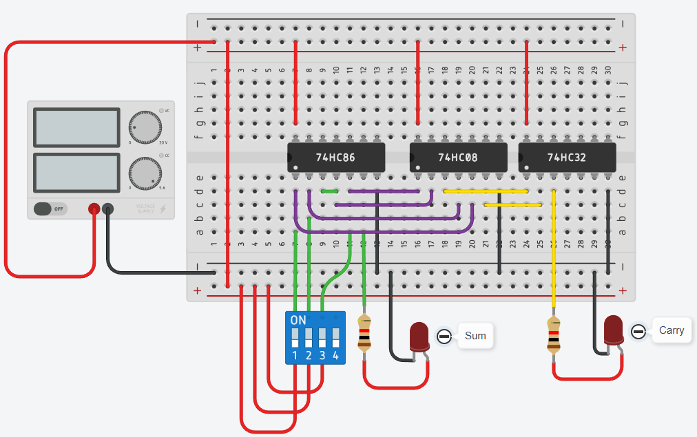
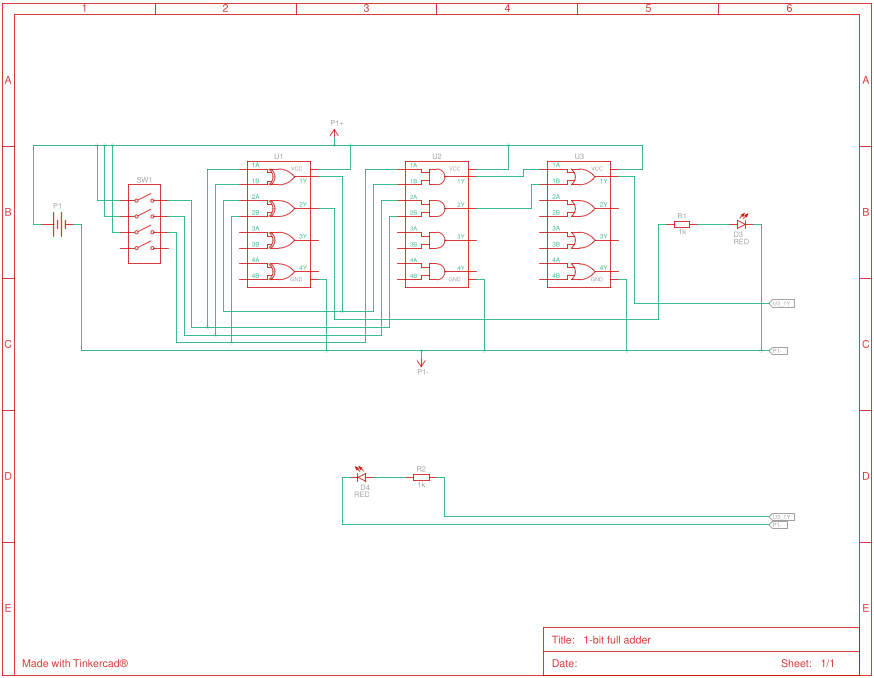
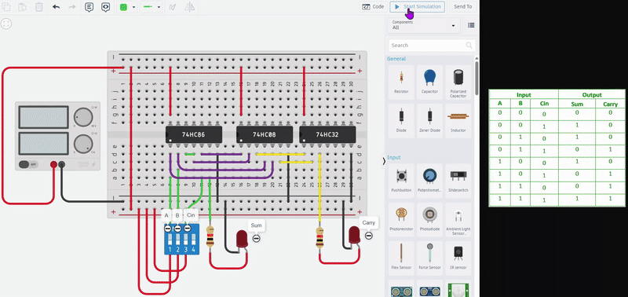
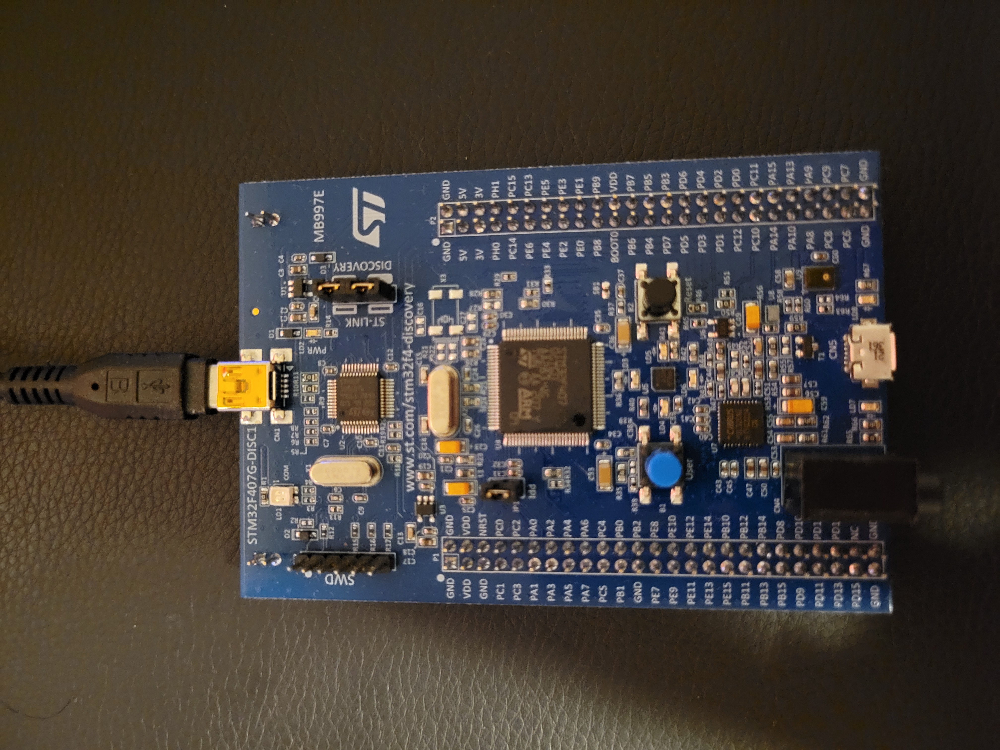
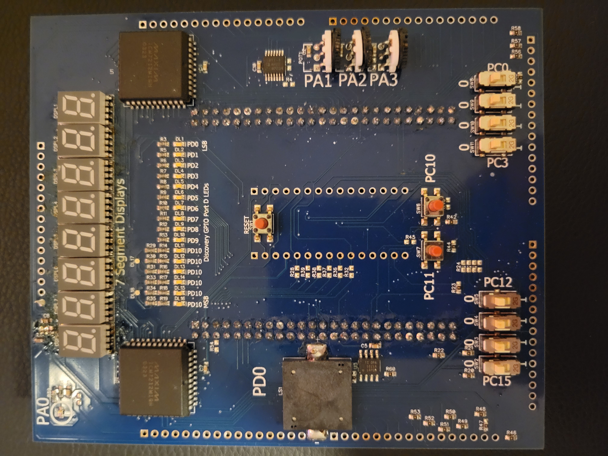
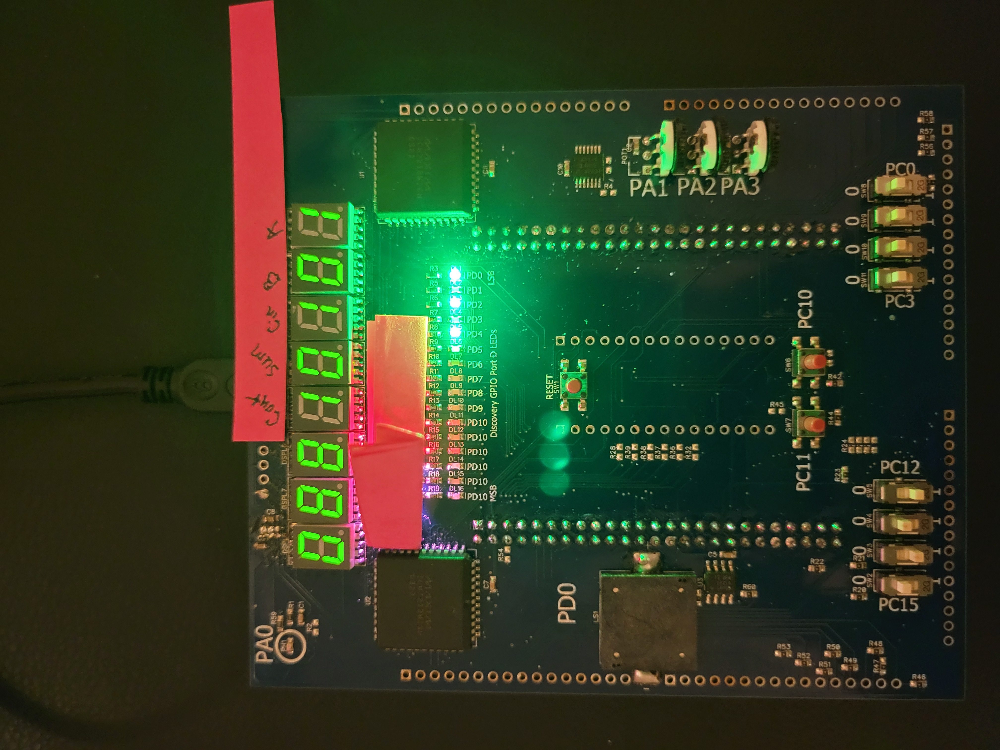
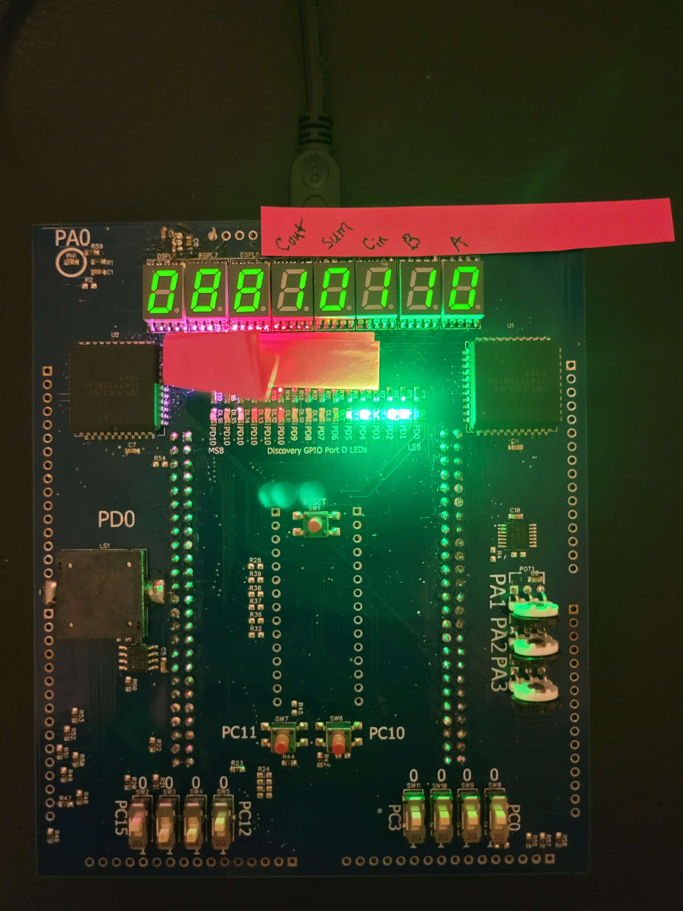
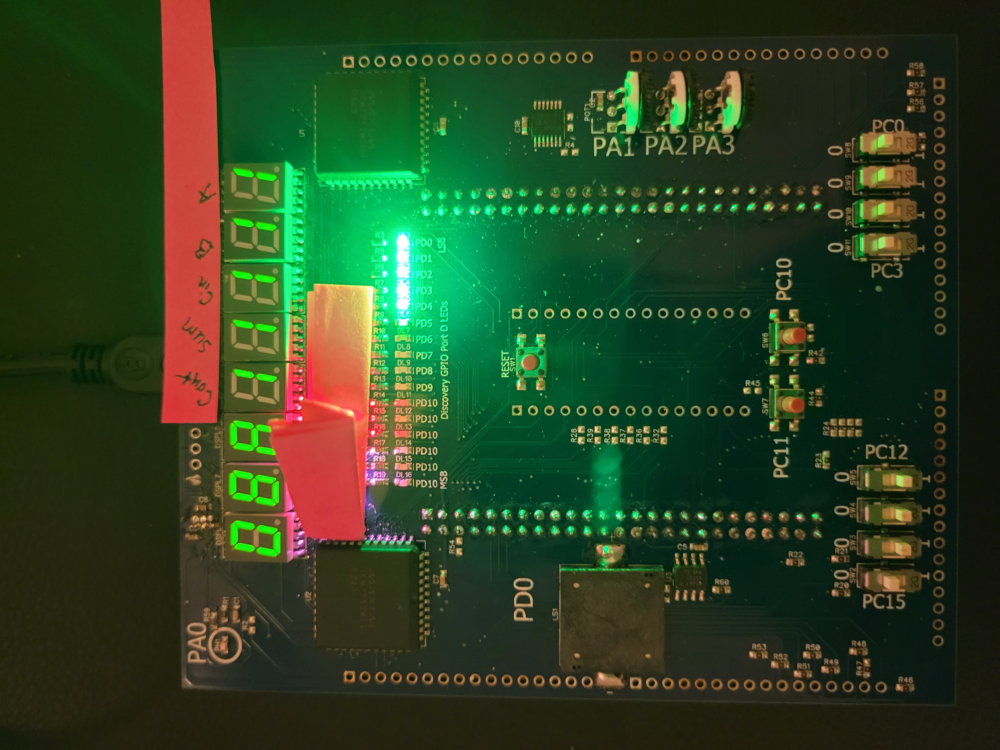

# 1-Bit Full Adder Simulation

## Overview
Demonstrates the design and simulation of a **1-bit Full Adder** using Tinkercad Circuits along with an optional exploration of a microcontroller setup. A full adder is a fundamental digital logic component used in arithmetic circuits to add three single-bit binary inputs: **A**, **B**, and **Carry-In (Cin)**. The circuit produces two outputs: the **Sum** and the **Carry-Out (Cout)**.

The design uses three basic logic gates **XOR**, **AND**, and **OR** to implement the standard full adder logic expressions shown in the formula section below. This demonstration illustrates how simple logic gates combine to perform binary addition at the hardware level, forming the building blocks for more complex digital systems such as multi-bit adders, arithmetic logic units (ALUs), and processors.

**Key Focus**: This project emphasizes understanding of digital logic and full adder behavior through simulation. The microcontroller integration is included as an exploratory learning exercise, demonstrating how digital circuits can interface with hardware.

## Formula

```math
Sum = A \oplus B \oplus Cin
```
```math
Cout = (AB) + (Cin(A \oplus B))
```

## Truth Table

| A   | B   | Cin | Sum | Cout |
|-----|-----|-----|-----|------|
| 0   | 0   | 0   | 0   | 0    |
| 0   | 0   | 1   | 1   | 0    |
| 0   | 1   | 0   | 1   | 0    |
| 0   | 1   | 1   | 0   | 1    |
| 1   | 0   | 0   | 1   | 0    |
| 1   | 0   | 1   | 0   | 1    |
| 1   | 1   | 0   | 0   | 1    |
| 1   | 1   | 1   | 1   | 1    |

**Tip**:
- XOR with **two inputs** output 1 if inputs differ.
- XOR with **more than two inputs** output 1 if the number of 1's input is **odd**.

## Components Used
### Tinkercad Simulation 
Logic ICs:
- 74HC86 – Quad XOR gate
- 74HC08 – Quad AND gate
- 74HC32 – Quad OR gate

Inputs:
- 4-position DIP switch (used for A, B, Cin, and optional extra input/unused)

Outputs:
- 2 LEDs (Sum and Carry-Out outputs)
- 2 current-limiting resistors for the LEDs

Power and Connections:
- Breadboard
- DC Bench Power Supply
- Jumper wires

### Physical Simulation
Microcontroller + Peripheral Board:
- STM32F07G-DISC1 development board
- Custom Boise State University peripheral board (contains switches, LEDs, sensors, analog inputs, etc.)
- USB cable for powering/debugging STM32 board

## Developer Notes
- Uses the default STM32CubeIDE project structure for startup files, initialization, and folder organization.
- Hardware modeling and simulation were assisted using AI tools. Final design, validation, and integration were performed manually.

## Getting Started
### Tinkercad Simulation
1. Open Tinkercad Circuits
2. Import or recreate the 1-bit full adder circuit using the components listed.
3. Connect inputs (A, B, Cin) using switches and observe outputs (Sum, Cout) on LEDs.
4. Run the simulation to verify the logic for all input combinations.

### Physical Hardware Setup Using Makefile
1. Clone or download this repository.
2. Open a termial and navigate to the project root directory (where Makefile exists).
3. Build the project by running:
```bash
make
```
4. Flash the compiled binary to the STM32 board using:
```bash
make flash
```
5. To clean up build files, run:
```bash
make clean
```
6. Ensure the peripheral board is connected properly and test all input combinations.

**NOTE**: The hardware workflow is exploratory. The primary demonstration comes from the simulation of digital logic.

## Demonstration
### Tinkercad Circuit Setup


### Tinkercad Schematic


### Tinkercad Demo


### Physical Hardware Setup



### Hardware Demo (check "images/output" for complete outputs)




## Future Implementations
- Expand design into 4-bit ripple carry adder

## Additional Resources
[full adder basic](https://www.geeksforgeeks.org/digital-logic/full-adder-in-digital-logic/)

[markdown logic symbols](https://gist.github.com/zudsniper/fe553bc6a4ee94fcdd74bf4eb0722043)

[markdown mathematical expressions](https://docs.github.com/en/get-started/writing-on-github/working-with-advanced-formatting/writing-mathematical-expressions)
